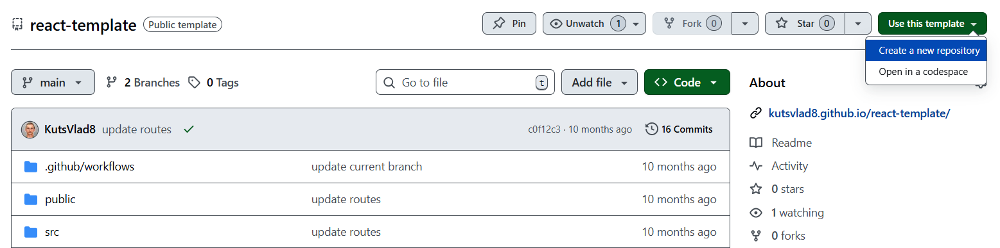
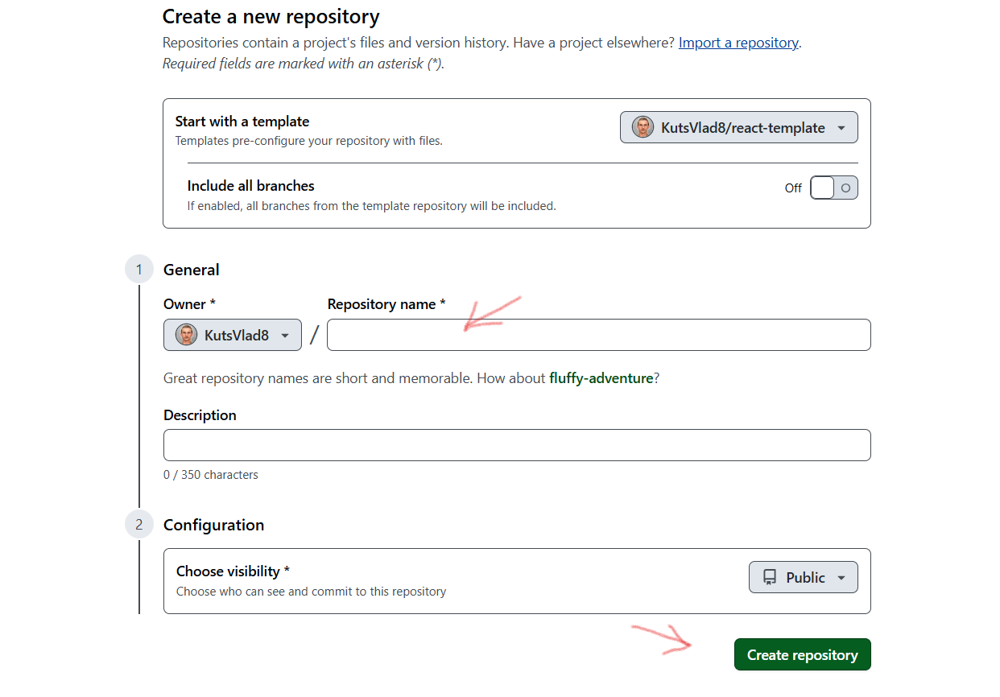
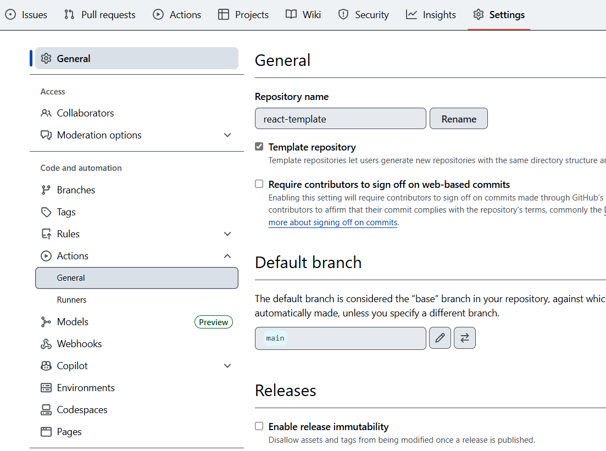
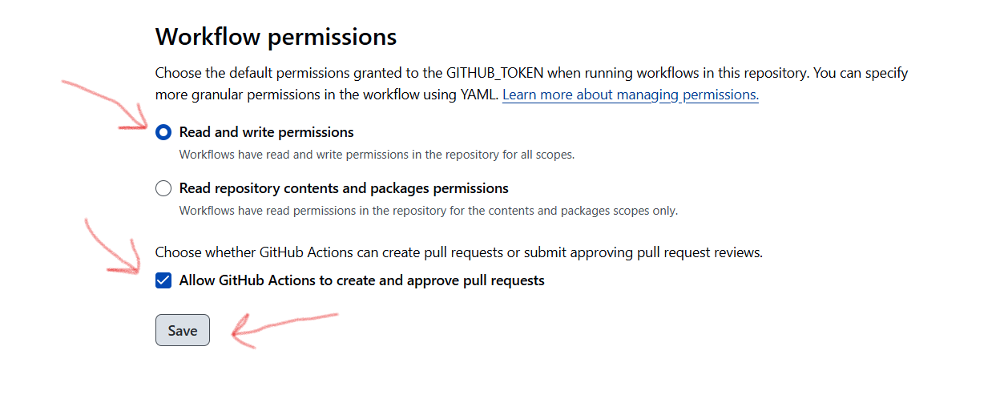
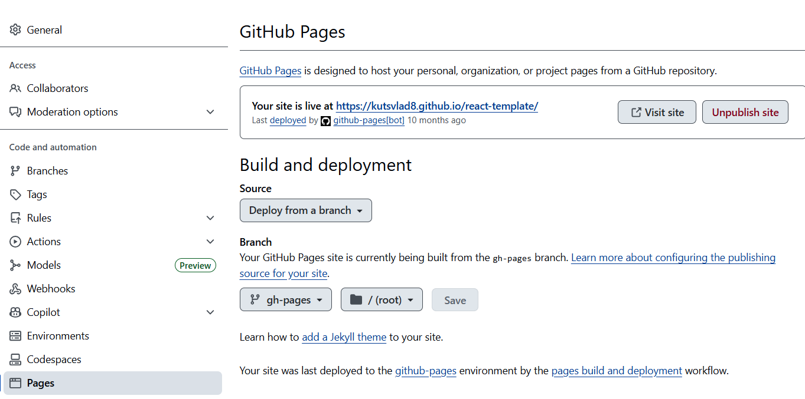

Використовуй цей репозиторій як шаблон для створення репозиторію свого проєкта. Для цього натисни на кнопку «Use this template» і вибери опцію «Create a new repository», як показано на зображенні.

На наступному кроці відкриється сторінка створення нового репозиторію. Заповни поле його імені, переконайся що репозиторій публічний, після чого натисни кнопку «Create repository from template».

Після того як репозиторій буде створено, необхідно перейти в налаштування створеного репозиторію на вкладку Settings > Actions > General як показано на зображенні.

Проскроливши сторінку до самого кінця, у секції «Workflow permissions» вибери опцію «Read and write permissions» і постав галочку в чекбоксі. Це необхідно для автоматизації процесу деплою проєкту.

### Підготовка до роботи

1.Переконайся що на комп'ютері встановлено LTS-версія Node.js. Завантаж і встанови її якщо необхідно.
2.Встанови базові залежності проєкту командою npm install.
3.Запусти режим розробки, виконавши команду npm start.
4.Перейди в браузері за адресою http://localhost:3000. Ця сторінка буде автоматично перезавантажуватися після збереження змін у файлах проєкту.

### Деплой

Продакшн версія проєкту буде автоматично проходити лінтинг, збиратися і деплоїтися на GitHub Pages, у гілку gh-pages, щоразу, коли оновлюється гілка main.
Наприклад, після прямого пушу або прийнятого пул-реквесту. Для цього необхідно у файлі package.json відредагувати поле homepage, замінивши your_username і your_repo_name на свої, і відправити зміни на GitHub.

Далі необхідно зайти в налаштування GitHub-репозиторію (Settings > Pages) і виставити роздачу продакшн-версії файлів із папки /root гілки gh-pages, якщо це не було зроблено автоматично.

